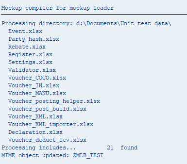
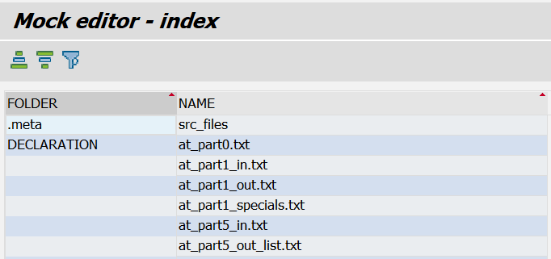
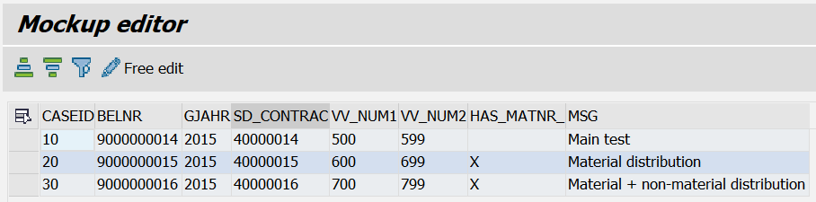
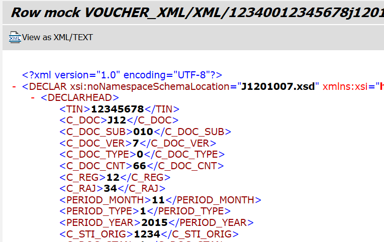

# ABAP mockup loader toolkit

This package contains helper tools for [Mockup loader](https://github.com/sbcgua/mockup_loader) abap unit testing framework.

- [Mockup compiler](#mockup-compiler)
- [Mockup viewer](#mockup-viewer)
- [Dependencies](#dependencies)

## Mockup compiler

SAP native tool to compile zip from excels for the Mockup loader and upload it to mime storage. Supports watching (re-process on file change).

The process flow is:
- you prepare excels with your data in a directory
- you run mockup compiler, specifying this directory and target MIME object name (tr. `SMW0` - the object must be created by then)
- optionally, keep the program in watch mode - then any change to the source excels will be immediately recompiled and re-uploaded to SAP
- optionally, you can also add include directory, content of which unconditionally included into zip file (useful to include e.g. XML files or other expected artifacts)

N.B. Watching is supported both for Excels and include directories. New files are detected, but new directories are not.

### Meta data

The mockup compiler adds meta data to the zip archive. It is stored in `.meta` subfolder. For the moment it keeps the source file sha1. This speeds up repeated compilations and watching. However if there is more than 1 person working on the test data (so multiple sets of source files) this obviously might not work well. For this (or to reset meta data for any other reason) use `re-build` flag at the selection screen - this will rebuild the file from scratch.

### Processing logic and Excel layout requirements

1. Finds all `*.xlsx` in the given directory.
2. In each file, searches for `_contents` sheet with 2 columns. The first is a name of another sheet in the workbook, the second includes the sheet into conversion if not empty. See example `test.ods` in the docs dir.
    - If `_contents` sheet was **not found** - all sheets are converted.
    - Another special sheet is `_exclude` - sheets with names listed there are excluded from conversion.
3. All the listed sheets are converted into tab-delimited text files in UTF8.
    - each sheet should contain data, staring in A1 cell
    - `'_'` prefixed columns at the beginning are ignored, can be used for some meta data
    - columns after the first empty columns are ignored
    - rows after the first empty row are ignored
    - if the first cell in the first row start with `#` - then this row is supposed to be a comment and skipped (can be used to add human readable comment to test files)
4. The resulting files are zipped and saved to target MIME object (which must exist by the time of compiler execution)
5. The file path in the zip will be `<excel name>/<sheet name>.txt`, **all lower-cased**.
6. If specified, files from `includes` directory explicitly added too

### Screenshots

### Known issues

- date is detected by the cell format style. Potentially not 100% reliable. Also at the moment converts unconditionally to `DD.MM.YYYY` form. To be improved. Log an issue with specific example, if needed.
- fractional numbers are not rounded. Results sometimes in values like `16.670000000000002`. Though in my *productive* test suites (which have a lot of amounts) this does not cause issues. Keep an eye.

### Sibling projects

There is also a [JS implementation](https://github.com/sbcgua/mockup-compiler-js) of the compiler. Works ~x10 faster than abap implementation, obviously due to lack of uploads of heavy excels over the network. It does not upload to SAP (though can be done via [w3mimepoller](https://github.com/sbcgua/abap_w3mi_poller)) so the abap implementation would fit usual scenarios more natively in most cases. 

Can be also used for CI flows e.g. to automatically render excel files, committed to a repo, as text in a separate branch for monitoring and control. Or for quick experiments without touching the SMW0 mime object.

## Mockup viewer

In-system tool to view zip W3MI mocks created for [Mockup loader](https://github.com/sbcgua/mockup_loader) by the [Mockup compiler](#mockup-compiler).

Run the program, enter MIME object name and preview the content. Double click to drill-down. tab-delivemited tables are supported, pure text files and xmls.

## Screenshots

## TODO
- potential develop light-weight editor abilities

## Dependencies
- [text2tab](https://github.com/sbcgua/abap_data_parser) - the library that converts data between abap structures and tab-delimited text. Also the dependency of the mockup loader itself.
- [abapGit](https://github.com/larshp/abapGit) - to install all above

### References and credits (ex dependencies)
- [w3mimepoller](https://github.com/sbcgua/abap_w3mi_poller) - used as a library as a lot of common code. Included as a contrib include `zmockup_compiler_w3mi_contrib.prog`. So not directly required. But it is a nice tool, have a look ;)
- [xlsxreader](https://github.com/sbcgua/xlsxreader/tree/custom) - native abap library to read XSLX files. Originally based on [this code](https://github.com/mkysoft/xlsxreader) by *mkysoft* but heavily reworked.
- [abap2xlsx](https://github.com/ivanfemia/abap2xlsx) - native abap excel parser. Used to be a dependency before 2019-12, then replaced with *xlsxreader*.